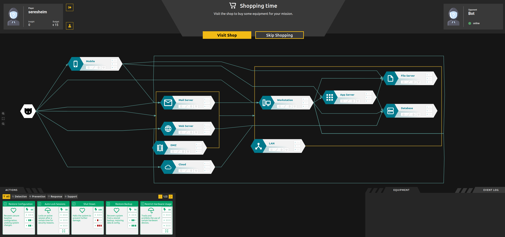

**************
PenQuest Recap
**************
In case you are already familiar with the game PenQuest you can skip this
chapter and continue with the next one, but in case you first found this package
whithout knowing about the game, here is a little recap. In case you want
further information about this game than just this recap, please visit 
https://www.pen.quest.

What is PenQuest?
=================

PenQuest is a digital board game where an attacker and a defender battle over 
several -- what we call -- assets in cyberspace. It is a turn-based partial
information game. Attackers have a specific in-game goal that they try to 
achieve (e.g. getting the domain controller of the defender offline), but they 
do not see the full network at the beginning of the game, only the systems that 
are exposed are visible to the attacker. Contrary, the defender does not know 
the attacker's specific goal, instead all his/her assets need to be defended 
from the attacker. However, the defender sees all assets from the beginning of 
the game, as its his/her own network (s)he is defending. 

The image above shows the defender's point of view at the beginning of the game.
In the center you can see the board consisting of multiple assets which are
linked via attack vectors. On the bottom left you can see the players actions
to play. In the top right corner you find the players' equipment -- the player
currently has not purchased any equipment yet. 

Win Conditions
--------------

The game ends when either the attacker manages to achieve his/her goal and 
therefore wins the game or, when the attacker's *initiative* -- a 'currency' for
the attacker's durability -- reaches zero, in which situation the defender wins 
the game.
The attacker's initiative decreases each turn by one point, as soon as the
defender first detects any of the attacker's action. As long as the defender
does not detect any action, the game may take infinite turns (theoretically 
possible, practically highly unlikely). 

Gameplay
--------

Players need to play actions which are depicted as cards from their hand onto
the game board. Some actions only affect a single asset and therefore need to 
dragged onto it, others affect multiple or all at once and therefore only need
to be dragged anywhere on the board. 

Each turn is separated into three phases:

:shopping phase: both players concurrently can shop for equipment that 
    may help them achieving their goal in the game. Both players need to finish 
    this phase until the attacker can proceed. 

:attack phase: the attackers turn to perform actions, the defender needs to wait
     until the attacker is finished 

:defense phase: the defenders turn to perform actions, the attacker needs to
    wait until the defende is finished

Attack- and defense phase behave very similarly for the respective roles:

    1. Detected opponent actions are shown in case the player detected any.
    2. Except for the very first turn, rewdraw at least one card.
    3. Play one action from the hand (supported by equipment and/or a support action). 

